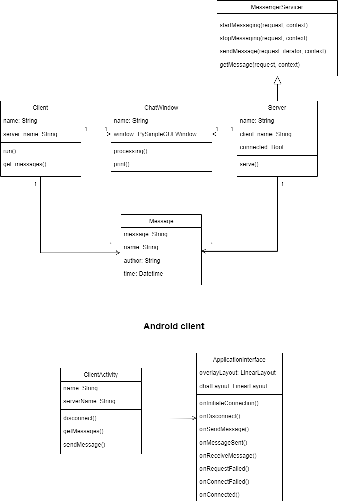

# GRPC-Chat

GRPC-chat is a basic cross-platform p2p messenger, which is implemented as a part of SPbU Software Architecture course.

## *Architecture*



There are 4 rpc-methods:

### rpc *getMessage* (MessengerMessage) returns (Empty)

Client calls *getMessage* for sending only message to server. Server returns nothing.

### rpc *sendMessage* (Empty) returns (stream MessengerMessage)

Client calls *sendMessage* for getting stream of messages from server. When next message has created, it is sent throughout stream to client.

### rpc *startMessaging* (MessengerNameRequest) returns (MessengerNameResponse)

Client calls *startMessaging* when it want to connect to server, say its name and receive server's name.

### rpc *stopMessaging* (Empty) returns (Empty)

Client calls *stopMessaging* when client want to disconnect.

## *How to run?*

  * Server:
```
$ make simple_server name=$server_name port=$port
```
  * Client:
```
$ make simple_client name=$client_name host=$server_host port=$port
```

## *How to run via docker?*

  * Server:
```
$ make simple_server_docker name=$server_name port=$port
```
  * Client:
```
$ make simple_client_docker name=$client_name host=$server_host port=$port
```

## *Android client*

### Screenshots


### Usage

1) Install [the client](./client.apk)
2) Launch server on pc and get *server hostname*
3) Send messages from text field

### Client architecture details

- ```ClientActivity``` duplicates logic from python client
- ```ApplicationInterface``` provides calls for various client events, which perform the required UI modifications (```onDisconnect```, ```onConnectionInitiated```)
  - The app has two layouts (connection and chat layout). When disconnected, it switches to connection layout and waits for user login
